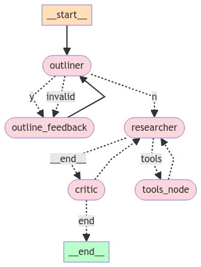

# Study Assistant



## Overview

**Study Assistant** is my personal console based **LangGraph** project that I created a couple of month ago for me to get Assistance for my final exam and also to put my LangGraph skills into work. It is designed to quickly generate study notes by researching a given subject. This tool is especially useful for exam preparation, providing a structured approach to creating concise and relevant notes.

## Features

- **Multi-Agent Environment**: Utilizes multiple agents to streamline the note-taking process.
- **Outliner**: Generates an initial outline for the topic.
- **Feedback Loop**: Allows for iterative refinement of the outline.
- **Researcher**: Uses Tavily to research each heading and gather content.
- **Critic**: Provides feedback and ensures the quality of the notes.
- **Output**: Final notes are stored in `content.md` and logs in `log.md`.

## Workflow

1. **Outliner**: Creates an outline for the subject.
   - Users can give feedback to refine the outline.
   - Once approved, it moves to the Researcher.

2. **Researcher**: Researches and writes content for each heading using Tavily.
   - Progress is reviewed by the Critic.

3. **Critic**: Provides constructive criticism or approves content.
   - The process repeats until all headings are completed.

4. **Completion**: Final notes are compiled into `content.md`.

## How to Use

1. **Clone the Repository**:

   ```bash
   git clone https://github.com/Malik-Talha/study-assistant.git
   cd study-assistant

2. Run the Application:

   ```bash
   python my_graph.py

## Contribution
We welcome contributions from the community! If you want to improve features, add new ones, or develop a UI, feel free to fork the repository, make changes, and submit a pull request.

## License
This project is open source and available under the MIT License.